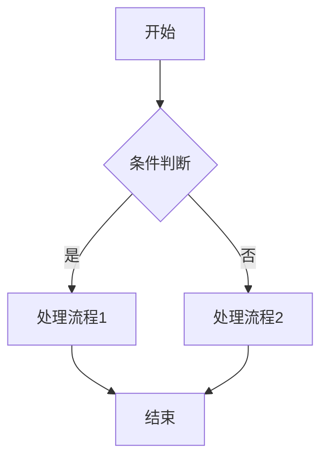
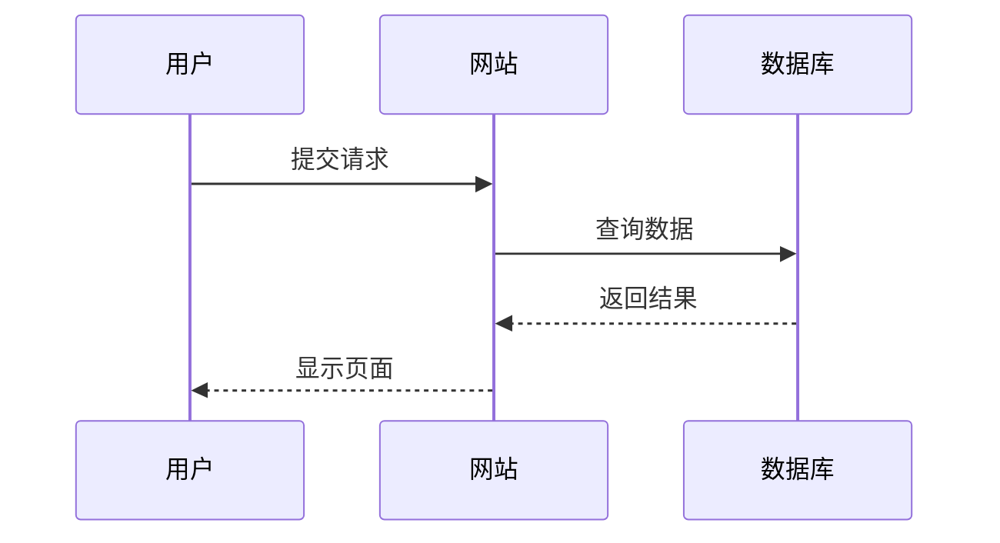
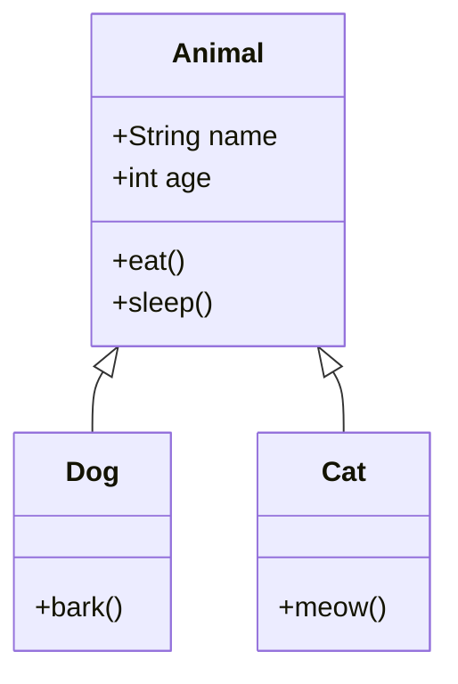
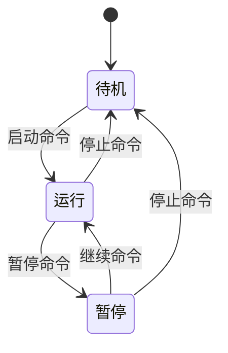
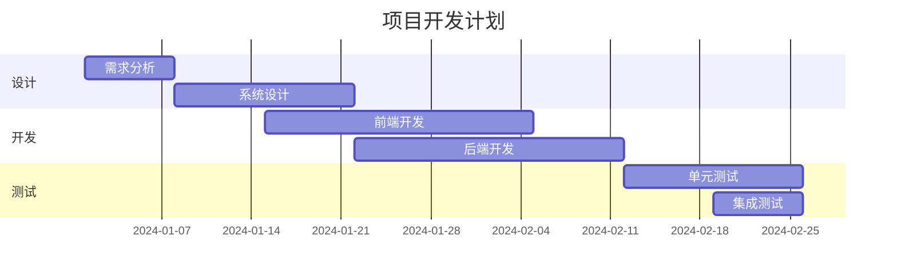
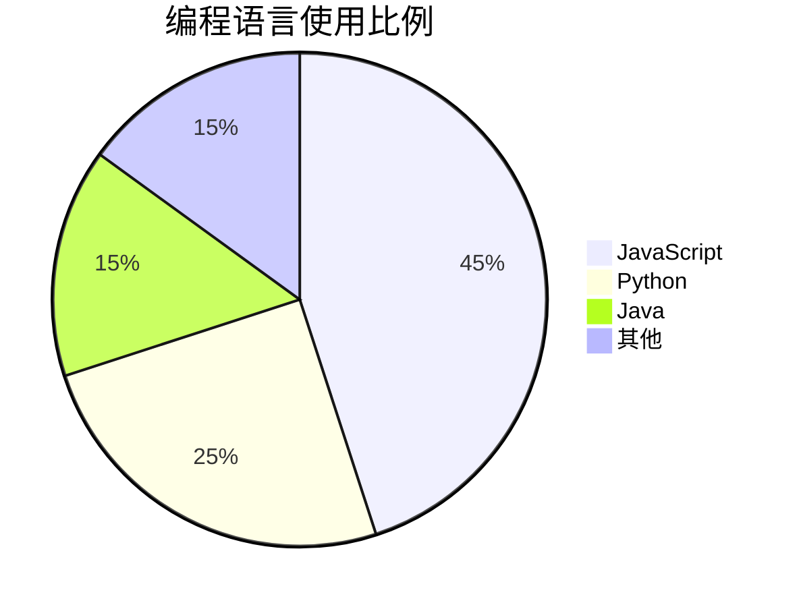

# Mermaid流程图教程

Mermaid是一个基于JavaScript的图表绘制工具，它允许你在Markdown中使用简单的文本语法来创建各种图表。本文将介绍Mermaid的基本用法。

## 流程图

流程图是最常用的图表类型之一：

## 序列图

序列图用于展示对象之间的交互顺序：

## 类图

类图用于展示面向对象设计中的类关系：

## 状态图

状态图用于展示对象的状态转换：

## 甘特图

甘特图用于项目进度管理：

## 饼图

饼图用于展示数据比例：

## 使用技巧

1. **语法简洁**：Mermaid使用简单的文本语法，易于学习和使用
2. **实时预览**：支持实时渲染，修改后立即看到效果
3. **多种图表**：支持流程图、序列图、类图、状态图、甘特图、饼图等
4. **主题定制**：可以通过CSS自定义图表样式

Mermaid是一个非常强大的工具，特别适合在技术文档中使用。通过简单的文本描述，就能生成专业的图表。
